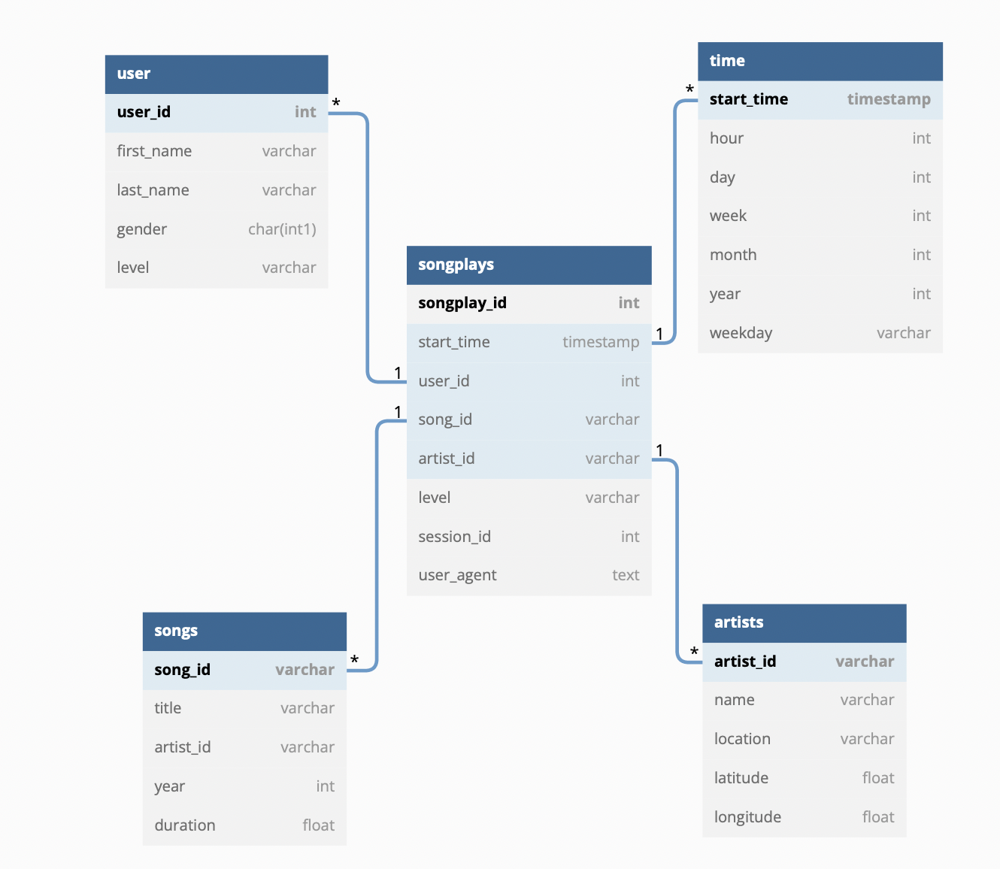

# Data Warehouse

## Diagram
diagram created using https://dbdiagram.io/d


## How to run
### Environment setup
1. Create virtual environmnet and source it
```
$ python3.10 -m vevv .venv
$ source .venv/bin/activate
```

2. Install requirements
```
$ pip install -r requirements.txt
```

### Start redshift cluster/database
1. Export key and sercrets
```
$ export KEY=insert_key_kere
$ export SECRET=insert_secret_kere
```

2. Fill in dwh.cfg` DWH` section. These will be used to create cluster

3. Set up database and amazon redshift
```
$ python aws_helper.py
```
* Note: You can clean/delete redshift by doing adding --clean_up flag:  

    `python aws_helper.py --clean_up`

This should have started the redshift and set up network in the right region. You can check status in AWS console page.

It will also update the config with necessary variables for the rest of the pipeline

### Create tables
```
$ python create_tables.py
```

### Fill in staging tables and then the rest of the tables
```
$ python etl.py
```